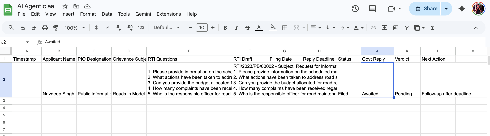

# 🚀 AI Agent – Automatic RTI Filer (RTI Copilot++ 🇮🇳)

> Making governance accessible with AI  
> Convert real-world complaints into **fully structured RTI applications automatically**

---

## 🌟 Overview

**RTI Copilot++** is an **AI-powered multi-agent system** that simplifies the process of filing RTIs (Right to Information requests) in India.

Instead of manually drafting complex RTIs, users can simply describe their issue — and the system takes care of everything:

- 🧠 Extracts key information  
- 🏢 Identifies correct department & PIO  
- 📝 Generates legally structured RTI questions  
- 📄 Drafts complete RTI (Form-1 compliant)  
- 📊 Tracks deadlines & responses  

---

## ⚙️ System Architecture

### 🔗 Workflow

---

### 🧩 Pipeline Breakdown

1. **User Input (Complaint)**
   - Example: "Roads are broken, potholes everywhere"

2. **Input Normalization**
   - Cleans and structures raw input

3. **Data Validation**
   - Ensures correctness

4. **🧠 Data Extraction Agent**
   - Extracts:
     - Name  
     - Address  
     - Issue  
     - Location  

5. **🏢 Department Research Agent**
   - Finds:
     - Correct department  
     - Public Information Officer (PIO)

6. **📝 RTI Filing Agent**
   - Generates:
     - RTI questions  
     - Complete RTI draft  
     - Filing details  

7. **📤 Output Formatting**
   - HTML → Markdown → Clean RTI  

8. **📊 Data Logging**
   - Stores structured data in Google Sheets  

9. **📧 Notification System**
   - Sends email confirmation with:
     - Receipt number  
     - Filing date  
     - Reply deadline  

---

## 📊 Dataset / Tracking System

The system maintains:

- Applicant Name  
- RTI Questions  
- RTI Draft  
- Filing Date  
- Reply Deadline (30 days rule)  
- Status  
- Govt Reply  
- Verdict  
- Next Action  

---

## 🔥 Key Features

- 🤖 Multi-Agent AI Workflow  
- 🧾 Automatic RTI Draft Generation  
- 🏛️ Department & PIO Identification  
- 📊 Google Sheets Integration  
- ⏳ Deadline Tracking  
- 📧 Automated Email Alerts  
- 🧠 Smart Question Generation  
- 🛠️ Scalable Architecture  

---

## 🛠️ Tech Stack

- **AI Models**: OpenAI Chat Models  
- **Workflow Engine**: n8n  
- **Search API**: SerpAPI  
- **Storage**: Google Sheets  
- **Email**: Gmail Integration  
- **Formatting**: HTML → Markdown  

---

## 💡 Example Use Case

### Input:
